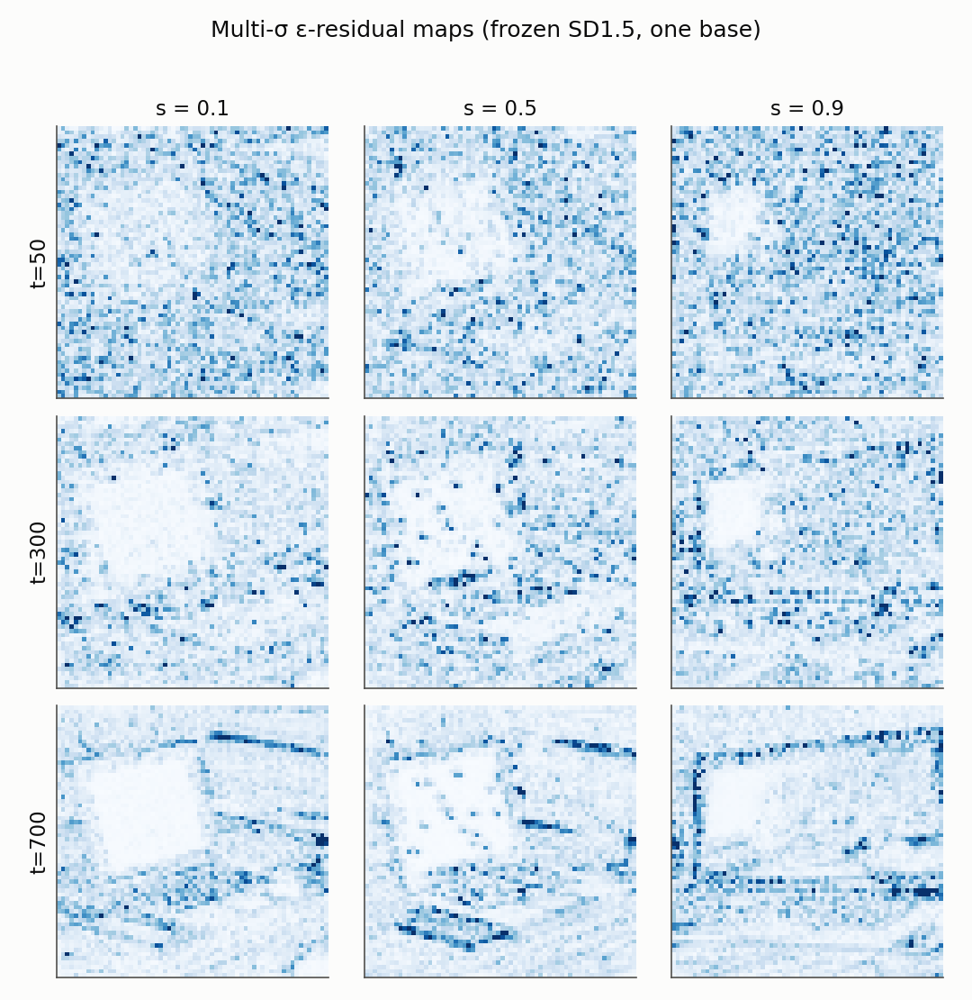
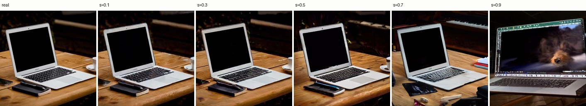
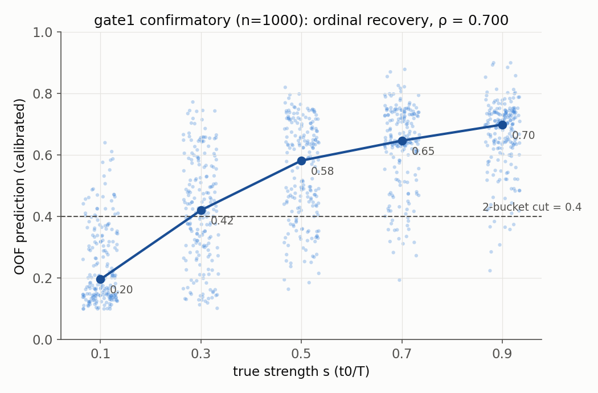
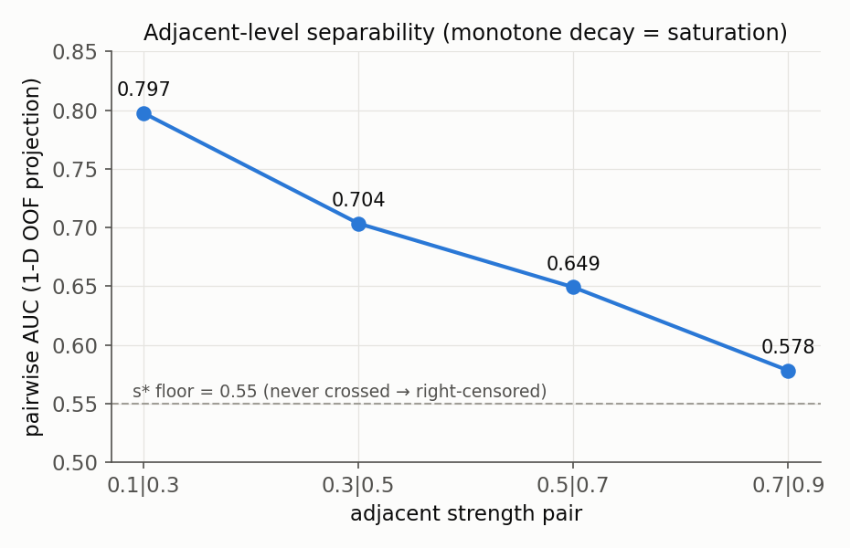
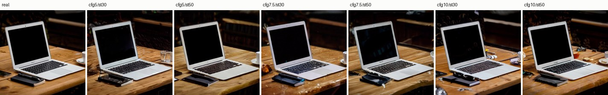

# 组会汇报：gate1（t0 可恢复性）预注册验证 —— 2026-07-15 实验日

> **一句话结论**：在预注册、锁定协议、一次性评估的条件下，**冻结 SD1.5 的多σ score 残差对 SDEdit 编辑强度实现了强序数恢复（ρ = 0.700，n = 1000）**——论文最承重也最受质疑的 t0 主张，从两周前的 WEAK（ρ≈0.48）落到了可发表的坚实档位；同时预注册的措辞门诚实地拦下了「逆估计」一词（MAE 差 0.011 未过线）。
>
> 论文主线回顾：*Inverting the Edit* —— 冻结扩散先验上的多σ Tweedie score 残差场，做检测 + 定位 + **算子逆估计 (t0, c, M)**。gate1 检验其中 t0 坐标：编辑强度是否在残差剖面上单调可恢复。

---

## 1. 背景：为什么这一天很关键

| 时间点 | gate1 状态 | 问题 |
|---|---|---|
| 7/02（mock 代理） | "PASS"（BA 0.76 / ρ 0.88） | **mock 假象**：mock 把 strength 线性写进像素 |
| 7/02（真实 SD1.5，n=50） | **WEAK**（BA 0.475 / ρ 0.476，多σ增量仅 +0.025） | 幅值特征触顶，论文题眼受威胁 |
| **7/15（本次）** | 预注册 confirmatory，n=1000 | **方向特征 + 换度量 + 预注册**三管齐下的判决日 |

方法诊断（7/09 定位）：提取器把 ε 预测误差 `r_ε` 与 x₀ 重建误差 `r_x` **相加坍缩**，逐 t 的方向/相位信息在出口就丢了——幅值触顶不是信号不存在，是特征只看了模长。

---

## 2. 实验设计（方法学部分，重点讲）

### 2.1 方向特征（Phase A①）

在 17 维幅值统计之后追加 **19 维方向/相位特征**：分离 r_ε/r_x 双通道逐 t 均值（2K）+ 相邻 t 的 ε 误差图方向余弦（K−1）+ ε/x 比值（K）。消融开关隔离「方向本身」的贡献，避免"特征更多"假象。

*特征的原材料：冻结 SD1.5 在 t∈{50,300,700} 的 ε 残差图（同一底图，s=0.1/0.5/0.9）。方向特征捕捉的是这些逐 t 图之间的相位/形状关系。*

*数据长相：同一照片经 SD1.5 img2img 以 s=0.1→0.9 编辑；s=0.9 全图重生成——SDEdit 真实性–忠实性权衡，即 t0 可恢复性的物理来源。*

### 2.2 预注册协议（PREREG v2，评估前锁定 commit）

- **判据先于数据写死**：主判据 ρ≥0.50 且 cluster-CI 下界>0.30；辅判据 2 桶（切点 0.4）BA≥0.66 且 CI 下界>0.55；**BA≥0.72 加档**「信息量不低于原三桶 0.55 门槛」；**MAE≤0.15 决定「逆估计」措辞权**；C4（多σ 增量）挂 Δρ(多σ幅值−单σ) 配对 bootstrap CI 下界>0。
- **协议**：Ridge(α=1) OOF（5 折×20 重复 **group** K-fold，按底图分组——同底图各强度版本永不跨折）+ 折内嵌套 isotonic 校准 + **按底图 cluster bootstrap**（B=2000，纠正此前逐行 CI 偏窄的问题）+ 三特征配置共享折与 bootstrap 索引 + **一次性评估**（报告已存在即拒跑）。
- **verdict 落点表机械抄写**，不允许解释性调整。n=50 的全部先行观测（含 2 桶 0.742）一律标探索性、不计入。

### 2.3 规模

n_base=200 × 5 强度档 = **1000 样本**（RTX 4090，生成 ~40 min + 提取 ~5 min）；另有 n=1500 的 CFG/steps 抖动补充 probe（预注册义务）。全天 GPU 成本 ≈ ¥15–20。

---

## 3. 主结果（confirmatory，n=1000）

| 配置 | ρ [95% cluster-CI] | 2桶BA (cut 0.4) | MAE |
|---|---|---|---|
| **幅值+方向（主）** | **0.700 [0.669, 0.728]** | **0.770 [0.745, 0.796]** | 0.161 [0.153, 0.169] |
| 仅幅值 | 0.576 [0.533, 0.616] | 0.707 | 0.190 |
| 单σ (t=50) | 0.501 [0.457, 0.543] | 0.645 | 0.206 |

| 配对增量 Δρ | 点值 | 95% CI | 结论 |
|---|---|---|---|
| 多σ幅值 − 单σ（**C4 判定对**） | +0.075 | [0.044, 0.106] | **「多尺度」一词保住**（此前 BA 口径 +0.025 的触顶疑云解除） |
| **方向特征增量**（主−幅值） | **+0.124** | [0.095, 0.156] | **本项目的方法贡献被 confirmatory 确证** |
| 完整表示 − 单σ | +0.199 | [0.161, 0.239] | |

*主图：1000 样本 OOF 预测 vs 真实强度，中位线单调 0.20→0.70；0.7→0.9 段趋平即高强度饱和。*

*相邻档位可分性 0.798→0.578 单调衰减——「信号单调但高强度端饱和」假说的直接证据；全程 ≥0.55（整个网格可分）。*

### 预注册 verdict（机械导出）

| 判据 | 结果 | 裁决 |
|---|---|---|
| 主判据（ρ） | 0.700，CI 下界 0.669 ≫ 0.30 | ✅ 大幅通过 |
| 辅判据 + 加档 | BA 0.770 ≥ 0.72 | ✅ 通过并加档（信息量 ≥ 原三桶 0.55 门槛） |
| MAE 措辞门 | 0.161 > 0.15（差 0.011） | ❌ **不以「逆估计」修饰 t0** |

**落档：t0 = 强序数恢复 + 粗桶强度分级（固定 CFG/steps 条件下）。** 这是"降级分支"的强版本——比预期的兜底强得多，但预注册的门没过就是没过。

---

## 4. 补充实验：CFG/steps 抖动（n=1500，预注册义务）

同 50 底图、s 网格不变，CFG{5,7.5,10}×steps{30,50} 逐单元独立 seed。结果：ρ=0.608 [0.559, 0.658]，相对主结果**跌幅 0.092 < 0.10** → 按预注册规则限定留脚注；且**多σ增量在抖动下反而扩大**（Δρ +0.143——单σ被 nuisance 打崩 0.50→0.36，多σ稳）→ "多σ表示对 nuisance 更鲁棒"是意外收获的可发表证据。

### ⚠️ 7/16 两处订正（组会必须如实讲）

1. **CFG 惰性发现**：全部 probe 用空 prompt → classifier-free guidance 的 CFG 项**数学上精确消去**（cond≡uncond）——实验⑤的 6 单元实际坍缩为 steps 30/50 两单元，跨 CFG 差异只是独立 seed。补充结论内部自洽（主实验同为空 prompt 域），但敏感度实由 **steps** 承载；带真 prompt 时 CFG 的敏感度**未测**。
2. **单元分解推翻"留脚注"**（9.6，零 GPU）：steps 边际 ρ **st30 = 0.707**（≈主结果，主场步数完全复现）vs **st50 = 0.514**（Δ≈−0.19）——pooled 跌幅 0.092 是**双峰混合的平均在掩盖单维效应**；(7.5,30) 单元重拟合 ρ=0.721 → nuis_effect=+0.113 > 0.10 → **按预定规则，「固定 CFG/steps」限定升级为正文 limitation**。两个判定并存如实记录，正文采更细的分解。

---

## 5. 对论文叙事的影响（G-A 决策门）

**允许的句子** ✅：t0 强序数恢复（ρ=0.70，cluster-CI）；粗桶分级 BA 0.77；信息量不低于三桶 0.55（Fano ≈0.14 bit）；多σ对 t0 有增量且对 nuisance 更鲁棒；方向/相位特征带来显著增量；高强度端饱和但整网格可分。
**禁止的句子** ❌：t0「逆估计」（MAE 门未过）；任何 provable；隐去 steps 敏感 limitation；把 n=50 探索数字当 confirmatory 引用。

**期权结构现状**：兜底线（定位+算子族+诚实局限）不再是唯一指望——t0 以"强序数恢复"进入正文主张；G-A 只剩**算子支**待 gate2 n≥200 复测（预注册 v3 草案已就绪）。

---

## 6. 过程性收获（可讲可略）

- **预注册的价值当天就兑现了两次**：①锁定前自动化驱动险些先评估 n=200——在特征提取阶段拦停（零标签接触），事件如实写入预注册尾部；②MAE 差 0.011 未过，措辞如实降级——没有预注册这两处都会变成"解释空间"。
- ρ 从 n=50 的 0.50 → n=1000 的 0.70：样本×4 + 锁定协议的多变量 Ridge OOF（比探索期估计器更强），来源全部合法。
- 三起工程事故（下载无超时挂死 82min / 险违锁定 / pull 静默失败旧代码起跑）全部修复并固化为断言与纪律（后续已落地为 preflight 工具与驱动公约）。

## 7. 下一步

1. **gate2（算子可分性）**：G-A 最后一支——设计已冻结（6 算子×3 生成器×面积桶、同底跨算子成对、null baseline=掩码几何探针）、PREREG v3 草案就绪，随 B3 主数据集生成一并出数。
2. **B3 主生成**（40–80k 图）：阻断项已基本清空（存储/负样本/compositing/防泄漏校验 V1–V12/采样政策全部落地并测试），剩 GPU 冒烟 + 扩盘。
3. 投稿前：带 prompt 的 CFG 敏感度补测（prompt bank 已就绪）。

---

*数据与可复现性：预注册 `docs/PREREG_gate1_v2_2026-07-15.md`（锁定）；报告 `checking/gate1_confirmatory_report_2026-07-15.md` 与补充/分解报告；特征 npz 双备份；全部图由锁定协议确定性复现（ρ 对齐 1e-4）。*
